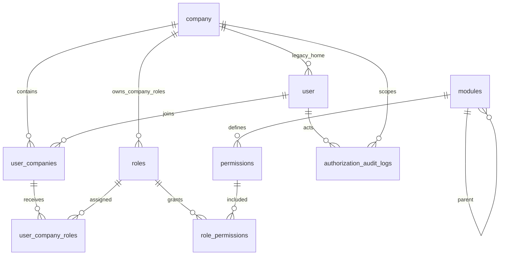

# IAM Migration and API Delivery Guide

## Architecture

The backend is a Java 17, Spring Boot 3.2 multi-module application.

- `domain`: legacy business entities and IAM entities, enums, repositories.
- `application`: use cases, DTOs, tenant access checks, authorization, cache invalidation, and audit orchestration.
- `infrastructure`: JPA adapters, JWT support, and persistence implementations.
- `interfaces`: REST controllers, validation, exception mapping, Spring Security, JWT and company-context filters.
- `bootstrap`: executable application, Flyway migrations, runtime configuration, and migration contract tests.

Authentication is stateless. The JWT filter establishes the authenticated legacy `User`. Except for explicitly exempt routes, `CompanyContextFilter` requires `X-Company-Id`, validates that the user has an active effective membership, stores the company UUID for the request, and clears it after processing. Method security then checks effective IAM permissions or the `SUPER_ADMIN` system role.

## Database and migration contract

Flyway is enabled in `bootstrap/src/main/resources/application.yml` with `baseline-on-migrate: true`, `baseline-version: 1`, and `classpath:db/migration`.

- V1 `V1__baseline_marker.sql`: complete legacy PostgreSQL schema copied from `database/001-schema.sql` through the final legacy index and stopping before seed data. It creates both extensions, legacy tables, constraints, and indexes. It creates no company or user rows.
- V2 `V2__create_multi_company_iam.sql`: creates memberships, module catalog, permission catalog, roles, role-permission assignments, membership-role assignments, authorization audit records, constraints, and indexes. Its foreign keys rely on V1 `company` and quoted `"user"`.
- V3 `V3__seed_iam.sql`: idempotently creates IAM catalog modules, API permissions, and `SUPER_ADMIN`; grants all active permissions to that role; migrates existing legacy users into memberships; and maps at most one active legacy administrator to `SUPER_ADMIN`. It creates no user account.
- V4 `V4__protect_system_roles.sql`: installs an idempotent trigger that prevents deletion or identity mutation of system roles.

For an empty database, Flyway executes V1 through V4. For a populated legacy schema without Flyway history, baseline-on-migrate records version 1 and starts at V2, so V1 does not recreate existing objects. Back up a configured database before migration and verify that its legacy schema matches `database/001-schema.sql`.

`DataInitializer` is restricted to the explicit `local` Spring profile. Deployments without that profile do not create a company or administrator account.

## File inventory

| File or area | Responsibility |
|---|---|
| `database/001-schema.sql` | Legacy schema reference; its seed section is not part of V1 |
| `backend/bootstrap/src/main/resources/db/migration/V1__baseline_marker.sql` | Empty-database legacy baseline |
| `backend/bootstrap/src/main/resources/db/migration/V2__create_multi_company_iam.sql` | IAM relational model |
| `backend/bootstrap/src/main/resources/db/migration/V3__seed_iam.sql` | IAM catalog and legacy identity mapping |
| `backend/bootstrap/src/main/resources/db/migration/V4__protect_system_roles.sql` | System-role immutability trigger |
| `backend/domain/src/main/java/com/tymui/agent/domain/iam` | IAM entities and enums |
| `backend/application/src/main/java/com/tymui/agent/application/service/iam` | IAM use cases |
| `backend/application/src/main/java/com/tymui/agent/application/security` | Tenant and permission services |
| `backend/interfaces/src/main/java/com/tymui/agent/interfaces/controller` | REST endpoints |
| `backend/interfaces/src/main/java/com/tymui/agent/interfaces/security` | Company context and permission expressions |
| `backend/interfaces/src/main/java/com/tymui/agent/interfaces/config/DataInitializer.java` | Local-profile-only sample initialization |
| `backend/bootstrap/src/test/java/com/tymui/agent/iam` | Static migration contract tests |

## Entity relationships



System roles have no company; company roles belong to exactly one company. Active role codes are unique within their scope. Membership and role assignments support effective time windows.

## IAM APIs and permissions

All paths below are relative to `/api/v1`. Protected requests carry `Authorization: Bearer <access-token>` and, unless exempt, `X-Company-Id: <company-uuid>`.

| Method and path | Required authorization |
|---|---|
| `POST /auth/login` | Public |
| `POST /auth/refresh` | Public |
| `GET /auth/me` | Authenticated; exempt from company context |
| `GET /me/companies` | Authenticated; exempt from company context |
| `GET /me/permissions` | Authenticated plus valid company context |
| `GET /me/menu` | Authenticated plus valid company context |
| `GET /companies/{companyId}/users` | `iam.company-user.list` |
| `POST /companies/{companyId}/users` | `iam.company-user.create` |
| `PUT /companies/{companyId}/users/{userId}` | `iam.company-user.update` |
| `DELETE /companies/{companyId}/users/{userId}` | `iam.company-user.remove` |
| `PUT /companies/{companyId}/users/{userId}/roles` | `iam.company-user.assign-role` |
| `GET /companies/{companyId}/roles` | `iam.company-role.list` |
| `GET /companies/{companyId}/roles/{roleId}` | `iam.company-role.view` |
| `POST /companies/{companyId}/roles` | `iam.company-role.create` |
| `PUT /companies/{companyId}/roles/{roleId}` | `iam.company-role.update` |
| `DELETE /companies/{companyId}/roles/{roleId}` | `iam.company-role.delete` |
| `PUT /companies/{companyId}/roles/{roleId}/permissions` | `iam.company-role.assign-permission` |
| `GET /companies/{companyId}/roles/{roleId}/users` | `iam.company-user.list` |
| `GET /modules/tree` | `iam.module.list` |
| `POST /modules` | `SUPER_ADMIN` |
| `PUT /modules/{id}` | `SUPER_ADMIN` |
| `DELETE /modules/{id}` | `SUPER_ADMIN` |
| `GET /permissions` | `iam.permission.list` |
| `GET /permissions/tree` | `iam.permission.view` |
| `POST /permissions` | `SUPER_ADMIN` |
| `PUT /permissions/{id}` | `SUPER_ADMIN` |
| `DELETE /permissions/{id}` | `SUPER_ADMIN` |

The path `companyId` is checked against the request company context in company-scoped services. Catalog writes are intentionally limited to `SUPER_ADMIN` even though catalog write permission constants are seeded.

## Authentication and request flow

1. Submit login data to `/auth/login` and retain the returned access and refresh tokens.
2. Call `/me/companies` with the access token to discover memberships.
3. Select a company UUID and send it as `X-Company-Id` on tenant-scoped calls.
4. `JwtAuthenticationFilter` validates the token and loads the user.
5. `CompanyContextFilter` validates the selected membership and effective dates.
6. `PermissionChecker` evaluates active role assignments and active permissions for that user-company pair. `SUPER_ADMIN` satisfies privileged checks through an effective system-role assignment.
7. IAM mutations record authorization audit data and invalidate affected authorization cache entries after transaction commit.

## Tests

`MigrationContractTest` reads packaged SQL only. It asserts that V1 creates `company` and then quoted `"user"` before V2 references them, and that V1 contains neither inserts nor shipped credentials. `IamMigrationTest` statically verifies the V4 trigger contract. These tests require no Docker service and make no network or database connection.

Any test that connects to a configured PostgreSQL instance must begin with a JUnit assumption equivalent to:

```java
Assumptions.assumeTrue(Boolean.parseBoolean(
        System.getProperty("IAM_MIGRATION_TEST", System.getenv("IAM_MIGRATION_TEST"))));
```

The opt-in value is `true`. The default test run must skip such a test, preventing accidental mutation of a configured database.

## Commands for a configured database

From `backend` in PowerShell, set deployment-specific values in the process environment, then run the application or migration-bearing build:

```powershell
$env:DB_URL = '<jdbc-postgresql-url>'
$env:DB_USERNAME = '<database-user>'
$env:DB_PASSWORD = '<database-secret>'
$env:JWT_SECRET = '<jwt-signing-secret>'
.\gradlew.bat bootRun --no-daemon
```

Build and local static verification do not opt in to a remote migration test:

```powershell
.\gradlew.bat clean test build --no-daemon
```

Enable a separately configured PostgreSQL migration test only in an isolated disposable database:

```powershell
$env:IAM_MIGRATION_TEST = 'true'
.\gradlew.bat test --no-daemon
```

## Curl examples

```bash
curl -X POST '<base-url>/api/v1/auth/login' \
  -H 'Content-Type: application/json' \
  -d '{"username":"<user-name>","password":"<user-secret>"}'

curl '<base-url>/api/v1/me/companies' \
  -H 'Authorization: Bearer <access-token>'

curl '<base-url>/api/v1/me/permissions' \
  -H 'Authorization: Bearer <access-token>' \
  -H 'X-Company-Id: <company-uuid>'

curl '<base-url>/api/v1/companies/<company-uuid>/roles?page=0&size=20' \
  -H 'Authorization: Bearer <access-token>' \
  -H 'X-Company-Id: <company-uuid>'

curl -X PUT '<base-url>/api/v1/companies/<company-uuid>/users/<user-uuid>/roles' \
  -H 'Authorization: Bearer <access-token>' \
  -H 'X-Company-Id: <company-uuid>' \
  -H 'Content-Type: application/json' \
  -d '{"roleIds":["<role-uuid>"]}'
```

## Deferred legacy issues

- Legacy controllers still use coarse `ADMIN`, `MANAGER`, and `ACCOUNTANT` authorities; only IAM controllers use the new permission model.
- The legacy `user.company_id` and `user.role` fields remain authoritative for legacy authentication compatibility while IAM memberships and roles coexist.
- V3 intentionally rejects migration when more than one active legacy administrator exists; operators must resolve that data condition before retrying.
- The local profile initializer remains sample-only behavior and must not be enabled in shared or production environments.
- The default datasource values target a developer workstation. Deployed environments must provide external configuration and a non-empty JWT signing secret.
